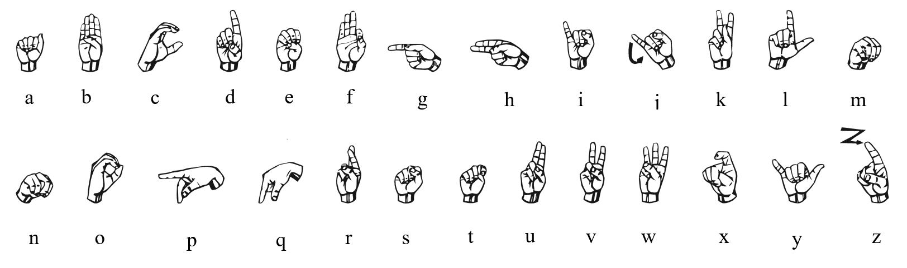
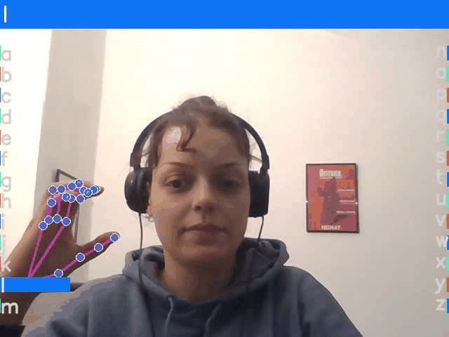

# Dynamic Fingerspelling Recognition 
## Using Sequential Deep Learning 


This repository is  linked to my master thesis. 
It contains the used configuration files  and [logging data](experiments/fingerspelling_RWTH_26) of the conducted experiments. 
As well as used [datasets](fingerspelling_dataset/I6) and sourcode of the implemented [GUI](application.py).
Additionally, checkpoints of the trained models are provided. 
This allows the application to be used without training. 


Aim of the master thesis was to develop a dynamic fingerspelling recognition system capable of recognizing dynamic fingerspelled letters, which involve movement.
The international Handalphabet is depicted in the following picture. 

 

***
### Data 


The used data set 
[I6_Gesture](https://www-i6.informatik.rwth-aachen.de/ftp/pub/I6_Gestures/)
was provided by the RWTH Aachen. 

In  folder [I6_Gestures](fingerspelling_dataset/I6_Gestures) the videomaterial split in test and training set 
is provided. Additionally, the extracted keypoints are provided in the folder [pkl_poses](fingerspelling_dataset/I6_Gestures/pkl_poses).

In folder [I6](fingerspelling_dataset/I6) the reduced data set can be found. 
It is reduced to the letters of the international Hand Alphabet. 


***
### Requirements 
The models used in the application are provided by the [Openhands](https://pypi.org/project/OpenHands/) library. 
Thanks to the developers providing the library and making sign language recognition more accessible.
Check the documentation of [Openhands](https://openhands.ai4bharat.org/en/latest/index.html) for further instructions on how to use the library. 
You can either run: 

```
pip install --upgrade OpenHands
```
To install the library. 
Or you can clone the repository and build the library from the latest source. 

````
pip install git+https://github.com/AI4Bharat/OpenHands
````

Additional requirements are provided in [requirements.txt](requirements.txt) file.
(It was created with `pip freeze > requirements.txt`. Probably other versions of the listed packages would work too). You at least need python 3.7+ running  in your environment. 

***
### Application 





After setting up your environment you can run the application with the following line of code.

```
python application.py
```
The checkpoints from previous training are provided and the model is created based on those checkpoints. 
The application is based on a LSTM Network. The model was plugged in with a GUI adapted from 
[Nick Renotte](https://github.com/nicknochnack/ActionDetectionforSignLanguage).


***
If you want to train the model by yourself you can run the following command in your terminal. 
You can specify in the training.py file which model you wish to train. 
```
python training.py 
```

***


## Authors and acknowledgment
Many thanks to Dreuw et al. (2006) from the RWTH Aachen for providing the database. 
If you want to use their dataset cite them as: 
```
@InProceedings { dreuw06smvp,
author= {Dreuw, Philippe and Deselaers, Thomas and Keysers, Daniel and Ney, Hermann},
title= {Modeling Image Variability in Appearance-Based Gesture Recognition},
booktitle= {ECCV Workshop on Statistical Methods in Multi-Image and Video Processing},
year= 2006,
pages= {7-18},
address= {Graz, Austria},
month= may,
booktitlelink= {http://www.vsi.cs.uni-frankfurt.de/misc/06_smvp/index.html},
pdf = {https://www-i6.informatik.rwth-aachen.de/publications/downloader.php?id=29&row=pdf}
}
```


Additionally, many thanks to the developers of Openhands. 
If you find their work useful consider citing them: 

```
@misc{2021_openhands_slr_preprint,
      title={OpenHands: Making Sign Language Recognition Accessible with Pose-based Pretrained Models across Languages}, 
      author={Prem Selvaraj and Gokul NC and Pratyush Kumar and Mitesh Khapra},
      year={2021},
      eprint={2110.05877},
      archivePrefix={arXiv},
      primaryClass={cs.CL}
}

@inproceedings{
      nc2022addressing,
      title={Addressing Resource Scarcity across Sign Languages with Multilingual Pretraining and Unified-Vocabulary Datasets},
      author={Gokul NC and Manideep Ladi and Sumit Negi and Prem Selvaraj and Pratyush Kumar and Mitesh M Khapra},
      booktitle={Thirty-sixth Conference on Neural Information Processing Systems Datasets and Benchmarks Track},
      year={2022},
      url={https://openreview.net/forum?id=zBBmV-i84Go}
}
```


Thanks to [Nick Renotte](https://github.com/nicknochnack/ActionDetectionforSignLanguage) providing the code of his 
project and a template for a GUI. 

